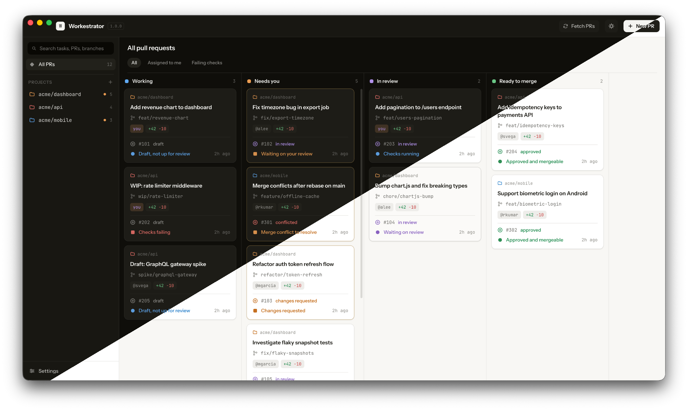

# Workestrator



Workestrator is a desktop app that turns your open pull requests into a board, and lets you dispatch an AI agent to review them or fix review comments — right in a git worktree of your own machine.

## What it does

- **Board view** — every open pull/merge request across your saved projects, pulled straight from `gh` and `glab`, laid out as cards you can act on.
- **Agent settings** — pick an [opencode](https://opencode.ai) agent for each board action: **Reviewer** (review PRs) and **Fixed** (fix review comments).
- **One-click reviews** — starting a review checks the pull request out into its own git worktree and runs your chosen Reviewer agent, streaming the result back live.
- **Local history** — every review is recorded in a local SQLite database, so you can revisit what the agent said, cancel a run in progress, or pick up where you left off.
- **No hosted backend** — the app shells out to CLIs you already have installed and authenticated (`gh`, `glab`, `git`, `opencode`); nothing leaves your machine except what those tools do.

## Requirements

- macOS, Windows, or Linux
- [Node.js](https://nodejs.org/) and npm
- [`gh`](https://cli.github.com/) and/or [`glab`](https://gitlab.com/gitlab-org/cli), signed in to the platforms your projects live on
- [`opencode`](https://opencode.ai) installed and configured with at least one primary agent, for running reviews

## Getting started

```bash
npm install
npm start
```

This launches the app in development mode via Electron Forge.

## Usage

1. Open **Add project** and pick a local git repository — its name and remote are read from the folder itself.
2. Workestrator fetches its open pull/merge requests and lists them on the board.
3. In **Settings**, pick an OpenCode agent for **Reviewer** and/or **Fixed**.
4. Click a card's review action to check the pull request out into its own worktree and set the agent loose. Progress and results show up in the task panel as the review runs.

## Scripts

| Command                                   | Description                                 |
| ----------------------------------------- | ------------------------------------------- |
| `npm start`                               | Run the app in development mode             |
| `npm run check`                           | Run every check CI runs, in one go          |
| `npm test`                                | Run the test suite (Vitest)                 |
| `npm run typecheck`                       | Type-check without emitting                 |
| `npm run lint` / `npm run lint:fix`       | Lint the codebase                           |
| `npm run format` / `npm run format:check` | Format the codebase with Prettier           |
| `npm run package`                         | Package the app without building installers |
| `npm run make`                            | Build platform installers                   |
| `npm run publish`                         | Publish a build                             |

Every one of these has a matching `make` target (`make check`, `make test`, …); run `make help` for
the list.

## Releasing

Releases are cut by pushing a tag. Bump `version` in `package.json` through a pull request, then:

```bash
git tag v0.2.0 && git push origin v0.2.0
```

[The release workflow](.github/workflows/release.yml) checks the tag against `package.json`, runs the
full check suite, builds on macOS (arm64 and x64), Windows and Linux, and publishes the installers as
a GitHub release. Tags containing a hyphen (`v0.2.0-beta.1`) go out as prereleases. The builds are
not code-signed yet, so the release notes include the Gatekeeper and SmartScreen workarounds.

## Contributing

Checks run at three points, so a mistake is caught as early as possible:

- **On save**, if you use an AI coding agent — the hooks in `.claude/` format the file it just wrote
  and feed lint problems straight back to it.
- **On commit** — husky + lint-staged format and fix the staged files, then run typecheck and tests.
- **On every pull request** — [CI](.github/workflows/ci.yml) runs format, lint, typecheck and test
  as separate jobs, so you see all the failures at once.

`npm install` sets up the git hooks. Conventions and architecture notes for both humans and agents
live in [AGENTS.md](AGENTS.md), with path-scoped rules in
[`.github/instructions/`](.github/instructions/).

### Working on this with an AI agent

The repository is set up for Claude Code and opencode alike, reading the same `AGENTS.md`, the same
scoped rules, and the same slash commands. Both get the same guardrails: destructive git and shell
commands are denied outright, anything that pushes or publishes asks first, and edited files are
formatted on the way past.

The harness is almost entirely markdown and declarative config — the deny/ask rules are plain
pattern lists, one per tool, rather than code. The single exception is a Stop hook that runs
`make check` before Claude Code can call the work done, which is the one behaviour that cannot be
expressed as data. See [the harness section of AGENTS.md](AGENTS.md#the-harness) for how the two
sides map onto each other, and for the one trap: the two rule files use **opposite** match
precedence.

`.opencode/agents/` holds a `reviewer` and a `fixer` agent written against this codebase — the ones
to point Workestrator's own **Reviewer** and **Fixed** board actions at when reviewing this repo.

## Tech stack

Electron, React 19, TypeScript, Vite, Tailwind CSS, and Electron Forge — with `node:sqlite` for local storage, so there's no native module to rebuild.

## License

MIT
